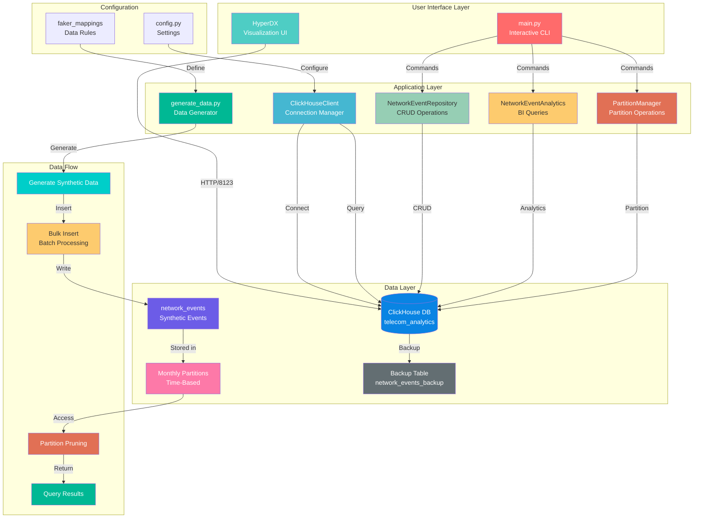

# 📡 ClickHouse Telecom Analytics Platform

A production-ready telecom analytics platform built with **ClickHouse**, featuring **synthetic network events**, **monthly partitioning**, **interactive CLI**, and **HyperDX visualization**.

> ⚠️ **DISCLAIMER:** This project generates and uses **synthetic (fake) telecom data** created by the Python Faker library. All user IDs, event types, locations, device information, and performance metrics are randomly generated and completely fictional. This project is intended for educational purposes, ClickHouse practice, and demonstration of big data analytics capabilities. No real user data, telecom operations, or network events are used.


---

## 📋 Table of Contents

- [Features](#-features)
- [Architecture](#-architecture)
- [Tech Stack](#-tech-stack)
- [Prerequisites](#-prerequisites)
- [Installation](#-installation)
- [Configuration](#-configuration)
- [Usage](#-usage)
- [CLI Commands](#-cli-commands)
- [Data Visualization](#-data-visualization)
- [Performance](#-performance)
- [Project Structure](#-project-structure)
- [Contributing](#-contributing)
- [License](#-license)

---

## ✨ Features

### 🗄️ **ClickHouse-Powered Analytics**
- **Large-scale synthetic telecom events** generated with realistic distribution
- **Monthly partitioning** for optimal query performance
- **MergeTree engine** with efficient data storage
- **Columnar storage** for fast analytical queries

### 🎲 **Realistic Data Generation**
- **15 major cities** with population-based weighting
- **11 network types** (2G, 3G, 4G, 5G, WiFi)
- **24 device types** (Android, iPhone, Desktop)
- **42 applications** (international + local apps)
- **Real-world traffic patterns** with peak/off-peak hours
- **Batch processing** with progress tracking

### 🖥️ **Interactive CLI**
- **20+ commands** for data exploration
- **Real-time query execution timing** from ClickHouse
- **Repository pattern** for clean data access
- **Analytics layer** for business intelligence
- **Partition management** commands

### 📊 **Visualization with HyperDX**
- **Native ClickHouse support** (no external plugins)
- **Live Tail** for real-time event streaming
- **Advanced search** with Lucene-like syntax
- **Custom dashboards** for network monitoring
- **Pattern analysis** for anomaly detection
- **Alert configuration** for critical metrics

### 🔧 **Production-Ready Features**
- Comprehensive error handling
- Connection timeout management
- Structured logging
- Type hints and docstrings
- Modular architecture

---

## 🏗️ Architecture



### Architecture Layers Explained

#### 1. **User Interface Layer**
- **Interactive CLI**: 20+ commands for data exploration and management
- **HyperDX Dashboard**: Visual observability platform

#### 2. **Application Layer**
- **ClickHouseClient**: Singleton connection manager with timeout handling
- **NetworkEventRepository**: CRUD operations, filters, pagination
- **NetworkEventAnalytics**: Business intelligence queries
- **PartitionManager**: Partition creation, migration, cleanup
- **DataGenerator**: Synthetic data generation with realistic distribution

#### 3. **Data Layer**
- **ClickHouse DB**: Columnar database with MergeTree engine
- **Synthetic Events**: Monthly partitioned for optimal performance
- **Time-Based Partitions**: Efficient data management and query pruning

---

## 🛠️ Tech Stack

| Component | Technology | Version |
|-----------|------------|---------|
| **Database** | ClickHouse | 26.4+ |
| **Language** | Python | 3.10+ |
| **Visualization** | HyperDX | 2-beta |
| **Container** | Docker | 27.5+ |
| **OS** | Ubuntu Linux | 22.04+ |
| **Libraries** | clickhouse-connect, Faker, tabulate | Latest |

---

## 📦 Prerequisites

### System Requirements
- **Linux Server** (Ubuntu 22.04+ recommended) or **Virtual Machine**
- **ClickHouse** installed on the server/VM
- **Docker Desktop** (for HyperDX visualization)
- **Python 3.10+** (for running the CLI)

### Software Requirements
- **ClickHouse** 26.4+ (installed on Linux server/VM)
- **Python** 3.10+ (on your local machine or server)
- **Docker** 27.5+ (for HyperDX on Windows/Linux)
- **Network connectivity** between your machine and ClickHouse server

---

## 🚀 Installation

### 1. Clone the Repository

```bash
git clone https://github.com/yourusername/clickhouse-telecom-analytics.git
cd clickhouse-telecom-analytics
```

### 2. Create Virtual Environment

```bash
# Windows
python -m venv venv
venv\Scripts\activate

# Linux/Mac
python3 -m venv venv
source venv/bin/activate
```

### 3. Install Dependencies

```bash
pip install -r requirements.txt
```

### 4. Configure Connection

Edit `config.py`:

```python
# Connection settings
CLICKHOUSE_HOST = "192.168.247.128"  # Your ClickHouse server IP
CLICKHOUSE_PORT = 8123
CLICKHOUSE_DATABASE = "telecom_analytics"
CLICKHOUSE_USERNAME = "default"
CLICKHOUSE_PASSWORD = ""

# Timeout settings
CONNECTION_TIMEOUT = 30
QUERY_TIMEOUT = 10
```

### 5. Start ClickHouse (On Linux Server)

```bash
# Check ClickHouse status
sudo systemctl status clickhouse-server

# Start if not running
sudo systemctl start clickhouse-server
```

### 6. Create Database and Table

```sql
-- Connect to ClickHouse
clickhouse-client

-- Create database
CREATE DATABASE IF NOT EXISTS telecom_analytics;

-- Use database
USE telecom_analytics;

-- Create table with partitioning
CREATE TABLE network_events (
    event_time DateTime,
    user_id UInt64,
    event_type String,
    country String,
    city String,
    device String,
    network_type String,
    app_name String,
    latency_ms UInt16,
    download_speed Float32,
    packet_loss Float32
)
ENGINE = MergeTree()
PARTITION BY toYYYYMM(event_time)
ORDER BY (event_time, user_id);
```

---

## ⚙️ Configuration

### Data Generation Settings

```python
# In generate_data.py
BATCH_SIZE = 50000          # Rows per batch
TOTAL_RECORDS = 5_000_000   # Total rows to generate
```

### Custom Data Rules

Edit data pools in `generate_data.py`:

```python
# Cities with population-based weights
CITIES = ["Tehran", "Mashhad", "Isfahan", ...]

# Apps (International + Local)
APPS = ["YouTube", "Instagram", "Soroush", "Eitaa", ...]

# Network types
NETWORKS = ["2G", "3G", "4G_LTE", "5G", "WiFi", ...]
```

---

## 🎮 Usage

### Start the CLI

```bash
python main.py
```

### Connect to ClickHouse

```
⏳ Connecting to ClickHouse...
✅ Connected successfully! Total events: 5,001,000

telecom>
```

### Generate Data

```bash
python generate_data.py
```

Output:
```
📊 Generating 5,000,000 telecom events...
======================================================================
📦 Batch 1: Inserted 50,000 rows | Total: 50,000 (1.0%) | Speed: 59834 rows/sec
📦 Batch 2: Inserted 50,000 rows | Total: 100,000 (2.0%) | Speed: 59830 rows/sec
...
======================================================================
✅ DONE!
📊 Total inserted: 5,000,000 rows
⏱️  Total time: 83.56 seconds
🚀 Average speed: 59834 rows/sec
```

---

## 📋 CLI Commands

### Basic Commands

| Command | Description |
|---------|-------------|
| `count` | Show total number of events |
| `sample [n]` | Show n sample events (default: 5) |
| `user <id>` | Show events and stats for a user |
| `latest [n]` | Show n latest events (default: 10) |
| `info` | Show table information |

### Analytics Commands

| Command | Description |
|---------|-------------|
| `top_apps [n]` | Show top n applications (default: 10) |
| `top_cities [n]` | Show top n cities (default: 10) |
| `network_quality` | Show network quality report |
| `daily_report [n]` | Show daily report for last n days |
| `hourly_heatmap` | Show hourly event distribution |
| `device_stats` | Show device statistics |

### Partition Management Commands

| Command | Description |
|---------|-------------|
| `partition_status` | Show table and partition status |
| `partition_create` | Create a partitioned table |
| `partition_migrate` | Migrate data to partitioned table |
| `partition_replace` | Replace original with partitioned table |
| `partition_show` | Show partition information |
| `partition_drop <YYYYMM>` | Drop a specific partition |
| `partition_clean <months>` | Drop partitions older than N months |
| `partition_merge` | Optimize table by merging partitions |

### Utility Commands

| Command | Description |
|---------|-------------|
| `query <SQL>` | Execute custom SQL query |
| `clear` | Clear the screen |
| `exit/quit` | Exit the CLI |

---

## 📊 Data Visualization

### HyperDX Setup

#### 1. Run HyperDX with Docker

```powershell
# Pull the image
docker pull docker.hyperdx.io/hyperdx/hyperdx-local:2-beta

# Run container
docker run -d --name hyperdx -p 8080:8080 docker.hyperdx.io/hyperdx/hyperdx-local:2-beta
```

#### 2. Access HyperDX

Open browser: `http://localhost:8080`

#### 3. Configure Data Source

| Setting | Value |
|---------|-------|
| **Name** | `telecom_analytics` |
| **Source Data Type** | `Log` |
| **Host** | `192.168.247.128` (your ClickHouse server IP) |
| **Port** | `8123` |
| **Database** | `telecom_analytics` |
| **Table** | `network_events` |
| **Timestamp Column** | `event_time` |
| **Default Select** | `event_time, user_id, event_type, country, city, device, network_type, app_name, latency_ms, download_speed, packet_loss` |

#### 4. Search Examples

```bash
# Simple searches
city:'Tehran'
event_type:'CALL_START'
app_name:'YouTube'
network_type:'5G'
latency_ms > 100

# Combined searches
city:'Tehran' AND event_type:'CALL_START'
app_name:'YouTube' AND latency_ms > 100

# Aggregations
* | stats count() by app_name | sort by count desc
* | stats avg(latency_ms) by network_type
* | stats count() by city | sort by count desc
* | stats count() by date_histogram(event_time, '1h')
```

---

## ⚡ Performance

### Data Generation Performance

| Metric | Description |
|--------|-------------|
| **Total Rows** | Configurable (millions) |
| **Batch Size** | 50,000 rows/batch |
| **Performance** | ~60,000 rows/sec |
| **Scalability** | Linear scaling with hardware |

### Partition Benefits

| Benefit | Description |
|---------|-------------|
| **Query Speed** | Partition pruning for faster queries |
| **Data Management** | Easy deletion of old partitions |
| **Storage** | Efficient per-partition storage |
| **Maintenance** | Independent partition operations |

---

## 📁 Project Structure

```
telecom_analytics/
│
├── main.py                      # CLI entry point
├── generate_data.py             # Data generation script
├── config.py                    # Configuration
├── requirements.txt             # Dependencies
│
├── database/
│   ├── __init__.py
│   └── clickhouse_client.py     # ClickHouse connection manager
│
├── repositories/
│   ├── __init__.py
│   └── network_event_repository.py  # CRUD operations
│
├── analytics/
│   ├── __init__.py
│   └── network_event_analytics.py   # BI queries
│
└── partition_manager/
    ├── __init__.py
    └── partition_manager.py         # Partition operations
```

---

## 🎯 Key Learnings

### ClickHouse Concepts Mastered

1. **MergeTree Engine**: Understanding the primary storage engine
2. **Partitioning**: Monthly partitioning for performance optimization
3. **Bulk Insert**: High-performance data ingestion
4. **Columnar Storage**: Understanding column-oriented databases
5. **Query Optimization**: Using partition pruning for speed

### Python Best Practices

1. **Repository Pattern**: Clean data access layer
2. **Analytics Layer**: Separation of business logic
3. **Singleton Pattern**: Single connection management
4. **Interactive CLI**: Using `cmd` module
5. **Type Hints**: Better code documentation

### DevOps Skills

1. **Docker**: Containerizing HyperDX
2. **Linux Server**: Managing ClickHouse on Ubuntu
3. **Network Configuration**: Port forwarding and connectivity
4. **Monitoring**: HyperDX for observability

---

## 🛠️ Troubleshooting

### Connection Issues

```bash
# Check if ClickHouse is running (on Linux server)
sudo systemctl status clickhouse-server

# Test connection from your machine
Test-NetConnection <SERVER_IP> -Port 8123

# Check port listening (on Linux server)
sudo ss -tulpn | grep 8123
```

### HyperDX Not Showing Data

```bash
# Adjust time range in HyperDX UI
# Default shows only last 24 hours
# Change to "Last 30 Days" or "Custom Range"
```

### Docker Permission Issues

```powershell
# Run Docker as Administrator
# Or add user to docker group
```

---

## 🚀 Future Enhancements

- [ ] **REST API** with FastAPI
- [ ] **Materialized Views** for faster reports
- [ ] **Data Retention Policies** automatic cleanup
- [ ] **Additional Tables** (Users, Cities, Devices)
- [ ] **Advanced Analytics** (RFM, Cohort, Anomaly)
- [ ] **Grafana Dashboards** (alternative visualization)
- [ ] **Performance Benchmarks** with large datasets
- [ ] **Docker Compose** for full stack setup
- [ ] **Unit Tests** with pytest

---
📸 Screenshots

CLI Interface
```text
╔══════════════════════════════════════════════════════════════╗
║       CLICKHOUSE TELECOM ANALYTICS - CLI                     ║
║                                                              ║
║  Type 'help' for list of commands                            ║
║  Type 'help <command>' for command details                   ║
║  Type 'exit' or 'quit' to exit                               ║
╚══════════════════════════════════════════════════════════════╝

telecom> count
📊 Total events: 5,000,000
```

HyperDX Dashboard


```text
http://localhost:8080
- Real-time event streaming
- Interactive search
- Custom dashboards
- Pattern analysis
```
***
## 🤝 Contributing

Contributions are welcome!

1. Fork the repository
2. Create a feature branch
3. Commit your changes
4. Push to the branch
5. Open a Pull Request

---

## 📝 License

This project is licensed under the MIT License - see the [LICENSE](LICENSE) file for details.

---

## 👤 Author

**Seyed Mohammad Javad Hosseini**
- GitHub: [@javad-hosseini](https://github.com/javad-hosseini)
- LinkedIn: [seyed-mohammad-javad-hosseini](https://www.linkedin.com/in/seyed-mohammad-javad-hosseini-b52962280/)

---

## 🙏 Acknowledgments

- **ClickHouse** - High-performance analytical database
- **HyperDX** - Observability platform
- **Faker** - Fake data generation
- **Docker** - Containerization

---

## ⭐ Support

Give a ⭐️ if this project helped you!

---

**Built with ❤️ for learning ClickHouse and Big Data Analytics** 🚀