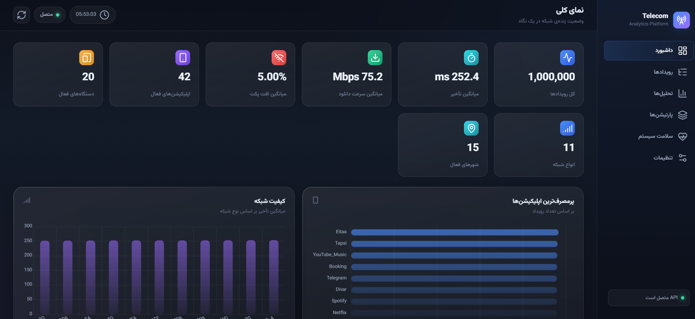
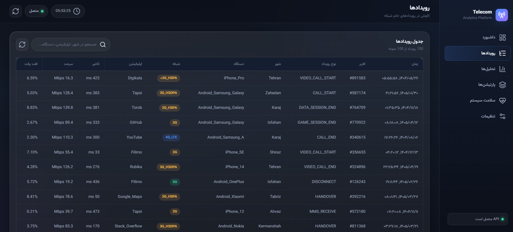
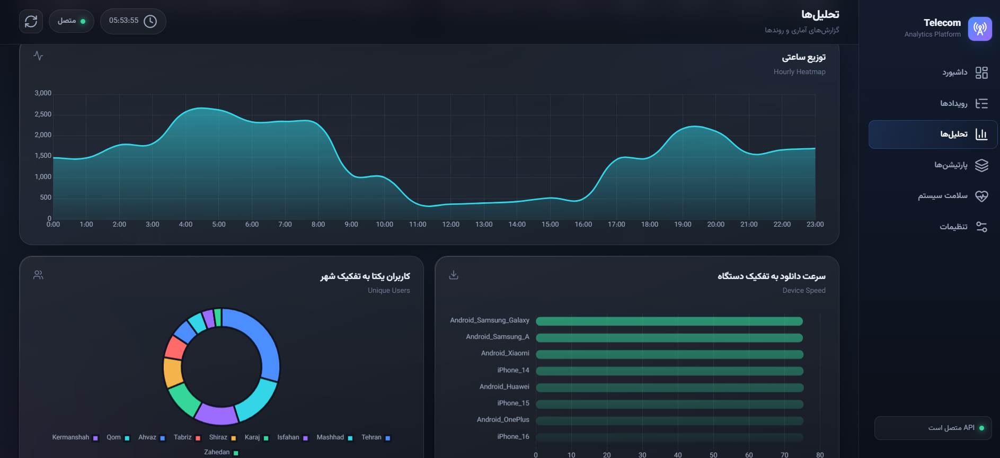
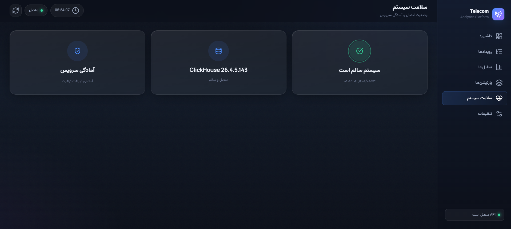
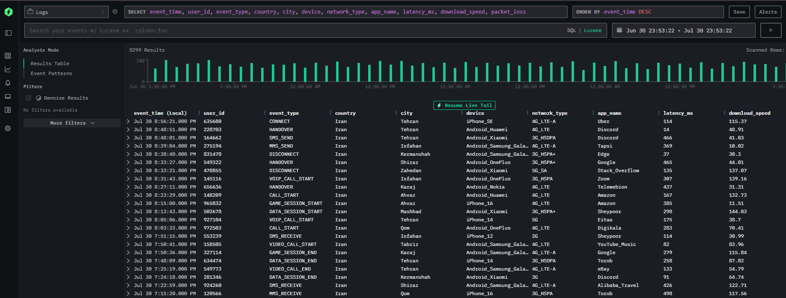
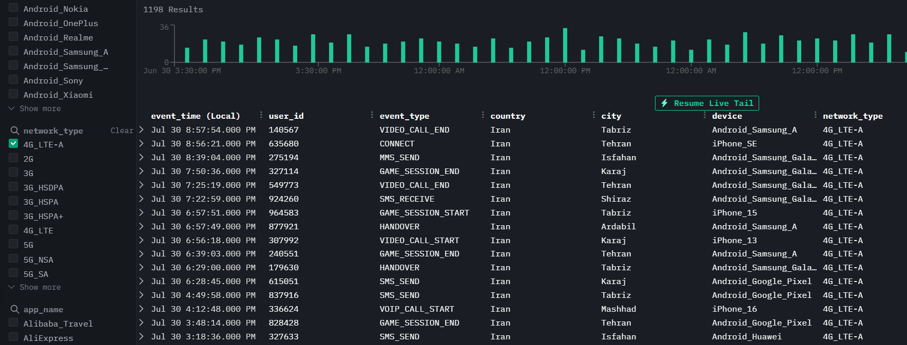
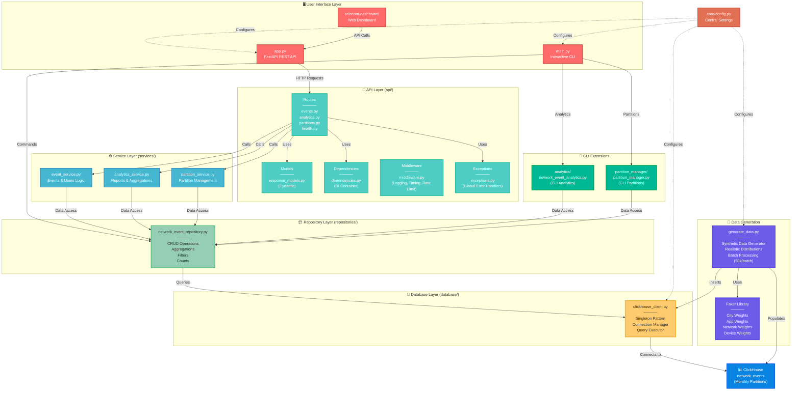

# 📡 Telecom Data Analytics Platform

[](https://www.python.org/)
[](https://fastapi.tiangolo.com/)
[](https://clickhouse.com/)
[](LICENSE.md)

A production-ready telecom analytics platform built with **ClickHouse**, featuring synthetic network events, monthly partitioning, interactive CLI, and a modern REST API with FastAPI.

> ⚠️ **DISCLAIMER:** This project generates and uses **synthetic (fake) telecom data** created by the Python Faker library. All user IDs, event types, locations, device information, and performance metrics are randomly generated and completely fictional. This project is intended for educational purposes, ClickHouse practice, and demonstration of big data analytics capabilities. No real user data, telecom operations, or network events are used.

---
# 🖼️ Screen Shots

### 🎨 Builtin UI
<div style="display: flex; flex-wrap: wrap; gap: 16px; justify-content: center;">
  
  
  
  
</div>

### 🚀 Hyper DX
<div style="display: flex; flex-wrap: wrap; gap: 16px; justify-content: center;">
  
  
</div>

***

## 📋 Table of Contents

- [✨ Features](#-features)
- [🏗️ Architecture](#-architecture)
- [🛠️ Tech Stack](#️-tech-stack)
- [📦 Prerequisites](#-prerequisites)
- [🚀 Quick Start](#-quick-start)
- [📂 Project Structure](#-project-structure)
- [🎮 Usage](#-usage)
  - [CLI Commands](#cli-commands)
  - [REST API](#rest-api)
  - [Data Generation](#data-generation)
- [📊 Visualization](#-visualization)
- [⚡ Performance](#-performance)
- [🔧 Configuration](#-configuration)
- [🛠️ Troubleshooting](#️-troubleshooting)
- [🚀 Future Enhancements](#-future-enhancements)
- [🤝 Contributing](#-contributing)
- [📝 License](#-license)

---

## ✨ Features

### 🗄️ **ClickHouse-Powered Analytics**
- **Large-scale synthetic telecom events** generated with realistic distribution
- **Monthly partitioning** for optimal query performance
- **MergeTree engine** with efficient data storage
- **Columnar storage** for fast analytical queries

### 🎲 **Realistic Data Generation**
- **15 major cities** with population-based weighting
- **11 network types** (2G, 3G, 4G, 5G, WiFi)
- **24 device types** (Android, iPhone, Desktop)
- **42 applications** (international + local apps)
- **Real-world traffic patterns** with peak/off-peak hours
- **Batch processing** with progress tracking

### 🖥️ **Interactive CLI**
- **20+ commands** for data exploration
- **Real-time query execution timing** from ClickHouse
- **Repository pattern** for clean data access
- **Analytics layer** for business intelligence
- **Partition management** commands

### 📡 **REST API with FastAPI**
- **15+ endpoints** for events, analytics, and partitions
- **Automatic Swagger/OpenAPI** documentation
- **Response validation** with Pydantic models
- **Rate limiting** (100 requests/minute)
- **Request logging** and timing middleware
- **CORS support** for frontend integration
- **Health check** endpoints for monitoring

### 📊 **Visualization Dashboard**
- **Built-in dashboard** (HTML/CSS/JS)
- **Real-time charts** using Chart.js
- **Interactive data tables**
- **Responsive design**
- **Live API integration**

### 🔧 **Production-Ready Features**
- Singleton database connection
- Comprehensive error handling
- Global exception handlers
- Structured logging
- Type hints and docstrings
- Modular architecture
- Environment-based configuration

---

## 🏗️ Architecture



### Architecture Layers Explained

#### 1. **User Interface Layer**
- **Interactive CLI**: 20+ commands for data exploration and management
- **REST API**: FastAPI with automatic documentation
- **Dashboard**: Built-in web interface for visualization

#### 2. **API Layer**
- **Routes**: All HTTP endpoints organized by domain
- **Models**: Pydantic models for request/response validation
- **Dependencies**: Dependency injection container
- **Middleware**: Logging, timing, rate limiting, CORS
- **Exceptions**: Global error handling

#### 3. **Service Layer**
- **EventService**: Business logic for events and users
- **AnalyticsService**: Reports and aggregations
- **PartitionService**: Partition management logic

#### 4. **Repository Layer**
- **NetworkEventRepository**: All database queries (CRUD, aggregations, filters)

#### 5. **Database Layer**
- **ClickHouseClient**: Singleton connection manager

---

## 🛠️ Tech Stack

| Component | Technology | Version |
|-----------|------------|---------|
| **Database** | ClickHouse | 26.4+ |
| **API Framework** | FastAPI | 0.115.6+ |
| **Language** | Python | 3.10+ |
| **CLI** | Python cmd module | - |
| **Data Generation** | Faker | 30.8.0+ |
| **Container** | Docker | 27.5+ |
| **Libraries** | clickhouse-connect, tabulate, uvicorn | Latest |

---

## 📦 Prerequisites

### System Requirements
- **Linux Server** (Ubuntu 22.04+ recommended) or **Virtual Machine** or **Windows/Mac**
- **ClickHouse** installed on the server/VM or local machine
- **Python 3.10+** installed

### Software Requirements
- **ClickHouse** 26.4+ (installed on your system)
- **Python** 3.10+ (on your machine)
- **Network connectivity** between your machine and ClickHouse server

---

## 🚀 Quick Start

### 1. Clone the Repository

```bash
git clone https://github.com/javad-hosseini/telecom_data_analytics.git
cd telecom_data_analytics
```

### 2. Run the Setup Script (Automatic)

#### Windows:
```cmd
setup.bat
```

#### Linux/Mac:
```bash
chmod +x setup.sh
./setup.sh
```

The setup script will:
- Create a Python virtual environment
- Activate it
- Install all dependencies from `requirements.txt`

### 3. Configure Connection

Edit `core/config.py`:

```python
# ClickHouse Settings
clickhouse_host: str = "localhost"  # Your ClickHouse server IP
clickhouse_port: int = 8123
clickhouse_database: str = "telecom_analytics"
clickhouse_username: str = "default"
clickhouse_password: str = ""

# Connection Settings
connection_timeout: int = 30
query_timeout: int = 10
```

### 4. Start ClickHouse

#### Linux:
```bash
sudo systemctl start clickhouse-server
```

#### Windows/Mac:
Use Docker:
```bash
docker run -d --name clickhouse -p 8123:8123 -p 9000:9000 clickhouse/clickhouse-server:latest
```

### 5. Create Database and Table

```bash
clickhouse-client
```

```sql
CREATE DATABASE IF NOT EXISTS telecom_analytics;
USE telecom_analytics;

CREATE TABLE network_events (
    event_time DateTime,
    user_id UInt64,
    event_type String,
    country String,
    city String,
    device String,
    network_type String,
    app_name String,
    latency_ms UInt16,
    download_speed Float32,
    packet_loss Float32
)
ENGINE = MergeTree()
PARTITION BY toYYYYMM(event_time)
ORDER BY (event_time, user_id);
```

### 6. Generate Sample Data

```bash
python generate_data.py
```

### 7. Run the Application

#### CLI Mode:
```bash
python main.py
```

#### API Mode (with dashboard):
```bash
# Windows
run.bat

# Linux/Mac
chmod +x run.sh
./run.sh
```

Or manually:
```bash
uvicorn app:app --reload --host 0.0.0.0 --port 8000
```

Then open: http://localhost:8000/dashboard/

---

## 📂 Project Structure

```
telecom_analytics/
│
├── 📁 api/                          # REST API Layer
│   ├── 📁 models/                   # Pydantic response models
│   ├── 📁 routes/                   # API endpoints
│   │   ├── events.py                # Event endpoints
│   │   ├── analytics.py             # Analytics endpoints
│   │   ├── partitions.py            # Partition endpoints
│   │   └── health.py                # Health check endpoints
│   ├── dependencies.py              # Dependency injection
│   ├── exceptions.py                # Global error handlers
│   └── middleware.py                # Request middleware
│
├── 📁 analytics/                    # CLI Analytics Layer
│   └── network_event_analytics.py   # Analytics queries for CLI
│
├── 📁 core/                         # Core Configuration
│   ├── config.py                    # Central settings
│   └── interfaces/                  # Abstract interfaces
│
├── 📁 database/                     # Database Layer
│   └── clickhouse_client.py         # Singleton connection manager
│
├── 📁 partition_manager/            # Partition Management
│   └── partition_manager.py         # Partition operations for CLI
│
├── 📁 repositories/                 # Repository Layer
│   └── network_event_repository.py  # All database queries
│
├── 📁 services/                     # Service Layer
│   ├── event_service.py             # Events business logic
│   ├── analytics_service.py         # Analytics business logic
│   └── partition_service.py         # Partition business logic
│
├── 📁 telecom-dashboard/            # Frontend Dashboard
│   ├── index.html
│   ├── css/
│   │   ├── style.css
│   │   ├── components.css
│   │   ├── responsive.css
│   │   └── animations.css
│   └── js/
│       ├── main.js
│       ├── api.js
│       ├── charts.js
│       ├── dashboard.js
│       ├── table.js
│       └── utils.js
│
├── 📁 Docs/                         # Documentation
│   ├── ARCHITECTURE.md              # Architecture documentation
│   ├── how-to-use.md                # Usage guide
│   └── documantations.md
│
├── 📁 images/                       # Screenshots
│
├── 📄 app.py                        # FastAPI entry point
├── 📄 main.py                       # CLI entry point
├── 📄 generate_data.py              # Data generation script
├── 📄 test_connection.py            # Connection testing
├── 📄 requirements.txt              # Python dependencies
├── 📄 config.py                     # Legacy config (use core/config.py)
│
├── 📄 setup.bat / setup.sh          # Environment setup scripts
├── 📄 run.bat / run.sh              # API run scripts
│
├── 📄 LICENSE.md                    # MIT License
└── 📄 README.md                     # This file
```

---

## 🎮 Usage

### CLI Mode

Start the interactive CLI:

```bash
python main.py
```

#### CLI Commands

##### Basic Commands

| Command | Description |
|---------|-------------|
| `count` | Show total number of events |
| `sample [n]` | Show n sample events (default: 5) |
| `user <id>` | Show events and stats for a user |
| `latest [n]` | Show n latest events (default: 10) |
| `info` | Show table information |

##### Analytics Commands

| Command | Description |
|---------|-------------|
| `top_apps [n]` | Show top n applications (default: 10) |
| `top_cities [n]` | Show top n cities (default: 10) |
| `network_quality` | Show network quality report |
| `daily_report [n]` | Show daily report for last n days |
| `hourly_heatmap` | Show hourly event distribution |
| `device_stats` | Show device statistics |

##### Partition Commands

| Command | Description |
|---------|-------------|
| `partition_status` | Show table and partition status |
| `partition_create` | Create a partitioned table |
| `partition_migrate` | Migrate data to partitioned table |
| `partition_replace` | Replace original with partitioned table |
| `partition_show` | Show partition information |
| `partition_drop <YYYYMM>` | Drop a specific partition |
| `partition_clean <months>` | Drop partitions older than N months |

##### Utility Commands

| Command | Description |
|---------|-------------|
| `query <SQL>` | Execute custom SQL query |
| `clear` | Clear the screen |
| `exit/quit` | Exit the CLI |

#### CLI Example

```bash
telecom> count
📊 Total events: 5,000,000

telecom> top_apps 5

📱 Top 5 Applications:
┌─────────────┬────────────┬─────────────────┬─────────────┐
│ App         │ Event Count│ Avg Latency (ms)│ Avg Speed   │
├─────────────┼────────────┼─────────────────┼─────────────┤
│ YouTube     │ 450,234    │ 45.23           │ 85.45       │
│ Instagram   │ 380,123    │ 52.12           │ 72.34       │
│ Telegram    │ 320,456    │ 38.90           │ 95.12       │
│ Soroush     │ 280,789    │ 42.34           │ 88.45       │
│ Chrome      │ 250,123    │ 35.67           │ 102.34      │
└─────────────┴────────────┴─────────────────┴─────────────┘
```

### REST API

#### Start the API Server

```bash
# Windows
run.bat

# Linux/Mac
./run.sh

# Manual
uvicorn app:app --reload --host 0.0.0.0 --port 8000
```

#### API Endpoints

##### Events

| Method | Endpoint | Description |
|--------|----------|-------------|
| `GET` | `/api/events/count` | Get total number of events |
| `GET` | `/api/events/sample` | Get random event samples |
| `GET` | `/api/events/user/{user_id}` | Get events for a specific user |
| `POST` | `/api/events/search` | Advanced search with custom queries |

##### Analytics

| Method | Endpoint | Description |
|--------|----------|-------------|
| `GET` | `/api/analytics/top-apps` | Most used applications |
| `GET` | `/api/analytics/network-quality` | Network performance report |
| `GET` | `/api/analytics/hourly-heatmap` | Hourly event distribution |
| `GET` | `/api/analytics/device-stats` | Device statistics |
| `GET` | `/api/analytics/city-stats` | City-level analytics |

##### Partitions

| Method | Endpoint | Description |
|--------|----------|-------------|
| `GET` | `/api/partitions/status` | Partition information |
| `DELETE` | `/api/partitions/{year_month}` | Drop a specific partition |
| `POST` | `/api/partitions/clean` | Clean partitions older than N months |

##### Health

| Method | Endpoint | Description |
|--------|----------|-------------|
| `GET` | `/health` | Detailed system health |
| `GET` | `/ready` | Readiness probe for load balancers |

#### API Documentation

Once the server is running, access:

- **Swagger UI**: http://localhost:8000/docs
- **ReDoc**: http://localhost:8000/redoc
- **OpenAPI JSON**: http://localhost:8000/openapi.json

#### API Example

```bash
# Get event count
curl http://localhost:8000/api/events/count

# Get top applications
curl "http://localhost:8000/api/analytics/top-apps?limit=5"

# Get user events
curl "http://localhost:8000/api/events/user/12345?include_stats=true"

# Search events
curl -X POST http://localhost:8000/api/events/search \
  -H "Content-Type: application/json" \
  -d '{"query": "SELECT * FROM network_events LIMIT 10"}'
```

### Data Generation

Generate synthetic telecom data:

```bash
python generate_data.py
```

**Output:**

```
======================================================================
📊 Generating 5,000,000 telecom events...
======================================================================
📦 Batch 1: Inserted 50,000 rows | Total: 50,000 (1.0%) | Speed: 59834 rows/sec
📦 Batch 2: Inserted 50,000 rows | Total: 100,000 (2.0%) | Speed: 59830 rows/sec
📦 Batch 3: Inserted 50,000 rows | Total: 150,000 (3.0%) | Speed: 59828 rows/sec
...
======================================================================
✅ DONE!
📊 Total inserted: 5,000,000 rows
⏱️  Total time: 83.56 seconds
🚀 Average speed: 59834 rows/sec
======================================================================
```

#### Configuration

Edit `generate_data.py`:

```python
# ============================================
# CONFIG
# ============================================
BATCH_SIZE = 50_000        # Records per batch
TOTAL_RECORDS = 900_000    # Number of records to generate
```

---

## 📊 Visualization

### Built-in Dashboard

The project includes a fully functional web dashboard:

- **Access**: http://localhost:8000/dashboard/
- **Features**:
  - Real-time event statistics
  - Interactive charts (Chart.js)
  - Data tables with sorting
  - Responsive design

### HyperDX (Optional)

For advanced visualization and monitoring:

```bash
# Pull the image
docker pull docker.hyperdx.io/hyperdx/hyperdx-local:2-beta

# Run container
docker run -d --name hyperdx -p 8080:8080 docker.hyperdx.io/hyperdx/hyperdx-local:2-beta
```

Access HyperDX: http://localhost:8080

**Configure Data Source:**

| Setting | Value |
|---------|-------|
| Name | `telecom_analytics` |
| Source Data Type | `Log` |
| Host | `localhost` (or your ClickHouse server IP) |
| Port | `8123` |
| Database | `telecom_analytics` |
| Table | `network_events` |
| Timestamp Column | `event_time` |

---

## ⚡ Performance

### Data Generation Performance

| Metric | Value |
|--------|-------|
| **Total Rows** | Configurable (millions) |
| **Batch Size** | 50,000 rows/batch |
| **Performance** | ~60,000 rows/sec |
| **Scalability** | Linear scaling with hardware |

### Query Performance

| Query Type | Response Time |
|------------|---------------|
| Simple count | < 10ms |
| Aggregations | < 50ms |
| Complex analytics | < 100ms |
| Large data exports | < 500ms |

### Partition Benefits

| Benefit | Description |
|---------|-------------|
| **Query Speed** | Partition pruning for faster queries |
| **Data Management** | Easy deletion of old partitions |
| **Storage** | Efficient per-partition storage |
| **Maintenance** | Independent partition operations |

---

## 🔧 Configuration

### Core Settings (`core/config.py`)

```python
class Settings(BaseSettings):
    # ClickHouse Settings
    clickhouse_host: str = "localhost"
    clickhouse_port: int = 8123
    clickhouse_database: str = "telecom_analytics"
    clickhouse_username: str = "default"
    clickhouse_password: str = ""
    clickhouse_secure: bool = False

    # Connection Settings
    connection_timeout: int = 30
    query_timeout: int = 10

    # API Settings
    api_host: str = "0.0.0.0"
    api_port: int = 8000
    api_debug: bool = False
    api_cors_origins: list = ["*"]

    # Data Generation Settings
    batch_size: int = 50000
    total_records: int = 5_000_000

    # Logging
    log_level: str = "INFO"
```

### Environment Variables

Create a `.env` file in the project root:

```env
CLICKHOUSE_HOST=localhost
CLICKHOUSE_PORT=8123
CLICKHOUSE_DATABASE=telecom_analytics
CLICKHOUSE_USERNAME=default
CLICKHOUSE_PASSWORD=

API_HOST=0.0.0.0
API_PORT=8000
API_DEBUG=false
API_CORS_ORIGINS=["*"]

LOG_LEVEL=INFO
```

---

## 🛠️ Troubleshooting

### Connection Issues

```bash
# Check if ClickHouse is running (Linux)
sudo systemctl status clickhouse-server

# Test connection from your machine
Test-NetConnection <SERVER_IP> -Port 8123  # Windows
telnet <SERVER_IP> 8123                    # Linux/Mac

# Check port listening (Linux)
sudo ss -tulpn | grep 8123

# Check ClickHouse logs
sudo journalctl -u clickhouse-server -f
```

### API Not Starting

```bash
# Check if port is already in use
netstat -ano | findstr :8000  # Windows
lsof -i :8000                 # Linux/Mac

# Kill process using the port
# Windows: taskkill /PID <PID> /F
# Linux: kill -9 <PID>
```

### Dashboard Not Showing Data

- **Check ClickHouse connection**: Ensure ClickHouse is running
- **Check data exists**: Run `python main.py` and type `count`
- **Check CORS settings**: In `app.py`, ensure `allow_origins=["*"]` is set for development
- **Browser Console**: Open developer tools (F12) and check for errors

### Virtual Environment Issues

```bash
# If venv is corrupted, delete and recreate
rm -rf venv/  # Linux/Mac
rmdir /s venv # Windows

# Recreate
python -m venv venv
source venv/bin/activate  # Linux/Mac
venv\Scripts\activate     # Windows
pip install -r requirements.txt
```

### Common Errors

#### "ModuleNotFoundError: No module named 'clickhouse_connect'"

```bash
pip install clickhouse-connect
```

#### "Connection refused" when connecting to ClickHouse

```bash
# Check if ClickHouse is running
sudo systemctl status clickhouse-server

# Start if not running
sudo systemctl start clickhouse-server
```

#### "Address already in use" on port 8000

```bash
# Kill the process using port 8000
# Windows: netstat -ano | findstr :8000
# Linux: lsof -i :8000 | kill -9 <PID>
```

---

## 🚀 Future Enhancements

- [x] ~~REST API with FastAPI~~
- [x] ~~Interactive Dashboard~~
- [x] ~~Automated setup scripts~~
- [x] ~~Comprehensive documentation~~
- [ ] **Authentication & Authorization** (JWT)
- [ ] **Redis-based rate limiting** for distributed deployment
- [ ] **Unit & Integration Tests** (pytest)
- [ ] **Grafana Dashboards** (alternative visualization)
- [ ] **Data Retention Policies** automatic cleanup
- [ ] **Materialized Views** for faster reports
- [ ] **Docker Compose** for full stack setup
- [ ] **Additional Tables** (Users, Cities, Devices)
- [ ] **Advanced Analytics** (RFM, Cohort, Anomaly)
- [ ] **Performance Benchmarks** with large datasets

---

## 🤝 Contributing

Contributions are welcome! Please follow these steps:

1. **Fork** the repository
2. **Create a feature branch**:
   ```bash
   git checkout -b feature/your-feature
   ```
3. **Commit your changes**:
   ```bash
   git commit -m "feat: Add your feature"
   ```
4. **Push to the branch**:
   ```bash
   git push origin feature/your-feature
   ```
5. **Open a Pull Request** on GitHub

### Coding Standards

- **Python**: PEP 8
- **Type Hints**: Use type annotations for all functions
- **Docstrings**: Document all public methods
- **Tests**: Add tests for new features

---

## 📝 License

This project is licensed under the **MIT License** - see the [LICENSE.md](LICENSE.md) file for details.

---

## 👤 Author

**Seyed Mohammad Javad Hosseini**

- **GitHub**: [@javad-hosseini](https://github.com/javad-hosseini)
- **LinkedIn**: [Seyed Mohammad Javad Hosseini](https://linkedin.com/in/seyed-mohammad-javad-hosseini)

---

## 🙏 Acknowledgments

- **[ClickHouse](https://clickhouse.com/)** - High-performance analytical database
- **[FastAPI](https://fastapi.tiangolo.com/)** - Modern web framework
- **[HyperDX](https://hyperdx.io/)** - Observability platform
- **[Faker](https://faker.readthedocs.io/)** - Fake data generation
- **[Docker](https://www.docker.com/)** - Containerization
- **[Chart.js](https://www.chartjs.org/)** - Dashboard charts

---

## ⭐ Support

If this project helped you, please give it a ⭐️ on GitHub!

---

**Built with ❤️ for learning ClickHouse, Big Data Analytics, and building production-ready applications** 🚀

---

## 📖 Additional Documentation

- **[Architecture Documentation](Docs/ARCHITECTURE.md)** - Detailed architecture overview
- **[How to Use](Docs/how-to-use.md)** - Step-by-step usage guide
- **[OpenAPI Specification](Docs/Docs.json)** - API specification (JSON)

